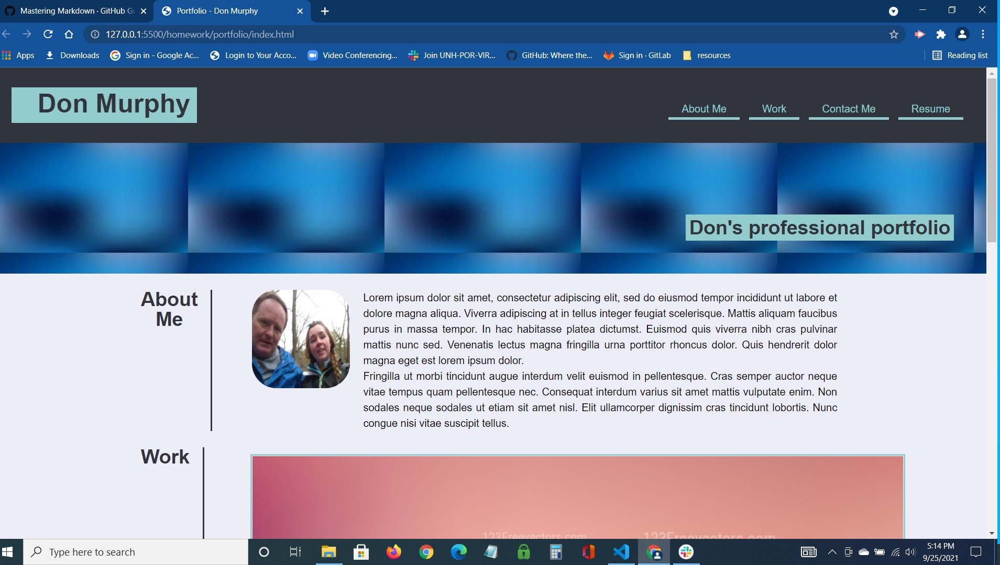

# Advanced CSS: Professional Portfolio

This is a web site containing my skills and talents:

## Highlights
* FlexBox was used to layout the entire page resulting in an accurate resemblence to the mockup.
* I designed a wirefare diagram for ths site which was very helpful.
* As always, CSS was heavily implemented.
* Please note the fancy mouse hover transitions on the nav links.
* When there was no application or other resourse to link to, I just linked to a temporary local page.
* The site is responsive to the size of a mobile phone. This was done with Flexbox and media queries.

## Repositoy: https://github.com/dpmurphy11/professional-portfolio
## Website: https://dpmurphy11.github.io/professional-portfolio/